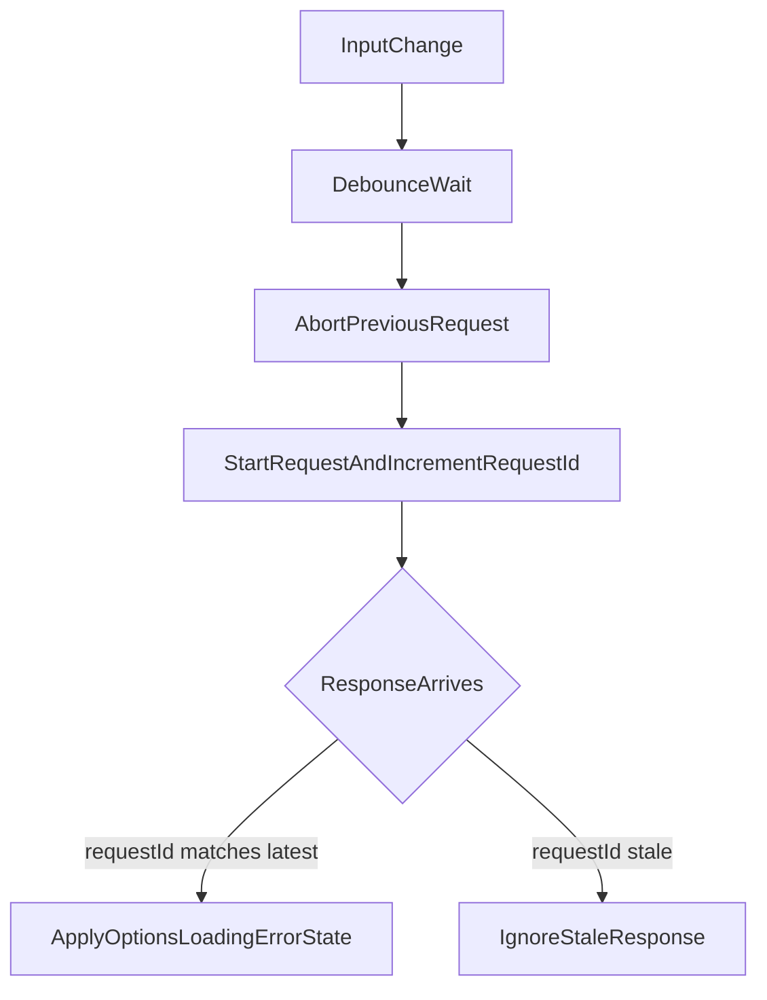

# SearchableSelect Assignment Plan

## Why This Plan Is Helpful For The Assignment
- It maps each assignment requirement to concrete files and implementation checkpoints.
- It calls out the subtle failure modes (async races, cancellation handling, keyboard/a11y parity) that naive implementations often miss.
- It includes an explicit validation path (tests + manual checks + build) so reviewers can quickly verify correctness.

## Requirement Coverage Map
- **Reusable searchable select**: [src/components/SearchableSelect.vue](src/components/SearchableSelect.vue)
- **Sync + async data sources**: [src/components/SearchableSelect.vue](src/components/SearchableSelect.vue), [src/data/countries.ts](src/data/countries.ts)
- **Debounce + cancel + stale-response guard**: [src/composables/useDebouncedAsyncOptions.ts](src/composables/useDebouncedAsyncOptions.ts)
- **Click outside close**: [src/composables/useClickOutside.ts](src/composables/useClickOutside.ts)
- **Keyboard and ARIA combobox/listbox semantics**: [src/components/SearchableSelect.vue](src/components/SearchableSelect.vue)
- **Focused high-risk tests**: [src/components/SearchableSelect.test.ts](src/components/SearchableSelect.test.ts)
- **Assignment explanation and AI workflow evidence**: [README.md](README.md), [.cursor/rules/*.mdc](.cursor/rules)

## Scope And Baseline
- Read and follow all rule files in [.cursor/rules/project-context.mdc](.cursor/rules/project-context.mdc), [.cursor/rules/vue-component-standards.mdc](.cursor/rules/vue-component-standards.mdc), [.cursor/rules/async-search-rules.mdc](.cursor/rules/async-search-rules.mdc), [.cursor/rules/accessibility-rules.mdc](.cursor/rules/accessibility-rules.mdc), and [.cursor/rules/review-checklist.mdc](.cursor/rules/review-checklist.mdc).
- Replace template scaffold usage in [src/App.vue](src/App.vue) (currently references `HelloWorld`) with assignment demo UI.
- Keep implementation focused and dependency-free (no UI libraries, no global store).

## File Structure (Required Deliverables)
- Create [src/types/searchable-select.ts](src/types/searchable-select.ts): shared type contracts for options, loader signatures, and emitted payloads.
- Create [src/composables/useClickOutside.ts](src/composables/useClickOutside.ts): reusable outside-click listener with mount/unmount cleanup.
- Create [src/composables/useDebouncedAsyncOptions.ts](src/composables/useDebouncedAsyncOptions.ts): debounced async loading state machine with cancellation + stale-response guard.
- Create [src/components/SearchableSelect.vue](src/components/SearchableSelect.vue): typed, reusable combobox/listbox component.
- Create [src/data/countries.ts](src/data/countries.ts): demo sync dataset and async mock loader source.
- Update [src/App.vue](src/App.vue): showcase both sync and async component usage and state visibility.
- Update [src/style.css](src/style.css): replace template-heavy styles with simple professional layout and accessible focus styling.
- Rewrite [README.md](README.md): assignment-oriented usage, architecture, a11y, async guarantees, tradeoffs, and AI workflow evidence.

## Component API (Planned Contract)
- `props` (explicit typed):
  - `modelValue: string | null` (selected option id)
  - `options?: SearchableSelectOption[]` (sync mode)
  - `loadOptions?: SearchableSelectLoader` (async mode)
  - `placeholder?: string`
  - `disabled?: boolean`
  - `minQueryLength?: number`
  - `debounceMs?: number`
- `emits` (explicit typed):
  - `update:modelValue` with selected id or `null`
  - `select` with full selected option object
  - optional `open-change` for demo observability if useful
- Behavior contract:
  - Sync mode filters `options` client-side from input.
  - Async mode uses loader per debounced query and drives loading/error/empty states.
  - Disabled options are rendered but never selected via click/keyboard.

## Async Race-Condition Strategy
- Centralize async orchestration in [src/composables/useDebouncedAsyncOptions.ts](src/composables/useDebouncedAsyncOptions.ts):
  - Debounce timer per query change.
  - `AbortController` for each in-flight request; abort old request before starting new.
  - Monotonic `requestId` increment; apply response only when `requestId === latestRequestId`.
  - Treat `AbortError` as controlled cancellation (no user-facing error state).
  - Expose typed refs: `options`, `isLoading`, `error`, `run`, `cancel`, `reset`.
  - Ensure cleanup of timer + controller on unmount.

## Keyboard And Accessibility Strategy
- Implement ARIA combobox/listbox semantics in [src/components/SearchableSelect.vue](src/components/SearchableSelect.vue):
  - Input `role="combobox"`, `aria-expanded`, `aria-controls`, and `aria-activedescendant` when highlighted.
  - Dropdown `role="listbox"`; options `role="option"` + `aria-selected`.
  - Stable ids for listbox and option rows for activedescendant mapping.
- Keyboard handling:
  - `ArrowDown`/`ArrowUp`: open when closed and move highlight with wrap/clamp behavior.
  - `Enter`: select currently highlighted enabled option.
  - `Escape`: close dropdown and clear transient highlight.
  - `Tab`: close dropdown and allow normal focus progression.
- Mouse/focus behavior:
  - Click selects option without breaking focus semantics.
  - Outside click closes via [src/composables/useClickOutside.ts](src/composables/useClickOutside.ts).
  - Preserve visible focus styles in [src/style.css](src/style.css).

## Demo Page Strategy
- In [src/App.vue](src/App.vue), render two independent examples:
  - Sync example using countries array from [src/data/countries.ts](src/data/countries.ts).
  - Async example using mock delayed loader that can return empty/error states.
- Display lightweight debug values (selected id/label, loading/error hints) so required behaviors are obvious during manual review.

## README And AI Workflow Documentation
- In [README.md](README.md), include:
  - Run steps (`npm install`, `npm run dev`, `npm run build`).
  - Component API table and typed usage examples (sync and async).
  - Async guarantees: debounce, cancellation, request-id stale protection.
  - Accessibility decisions and keyboard map.
  - Tradeoffs and non-goals.
  - AI workflow evidence section covering:
    - Cursor usage overall
    - Agent mode for scaffolding/implementation
    - Ask mode for async + accessibility review
    - Edit mode for targeted fixes
    - How each rule file constrained implementation decisions

## Validation Before Hand-off
- Manual checklist aligned with [.cursor/rules/review-checklist.mdc](.cursor/rules/review-checklist.mdc): sync/async, debounce, cancellation, stale guard, keyboard path, Enter/Escape/Tab/outside click, loading/empty/error, disabled option behavior.
- Run build/type-check (`npm run build`) and fix any introduced issues.

## Reviewer Quick-Run
- `npm run test:run` for focused behavioral tests (sync, keyboard, async, stale-response handling).
- `npm run build` for type-check and production build sanity.
